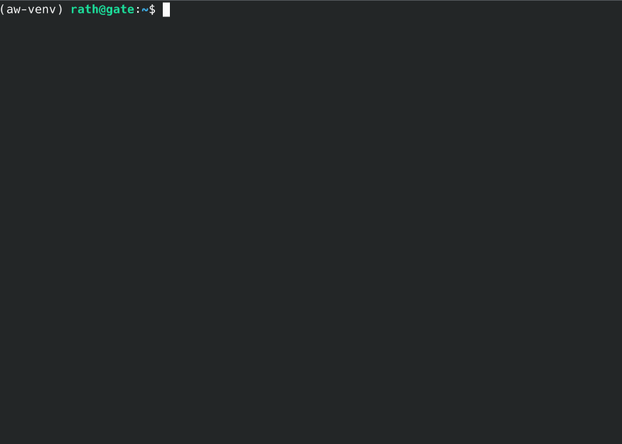
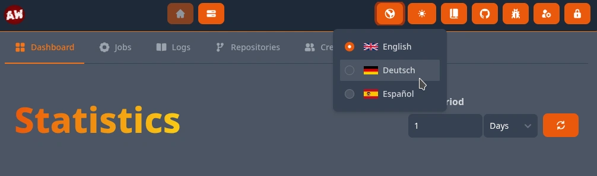
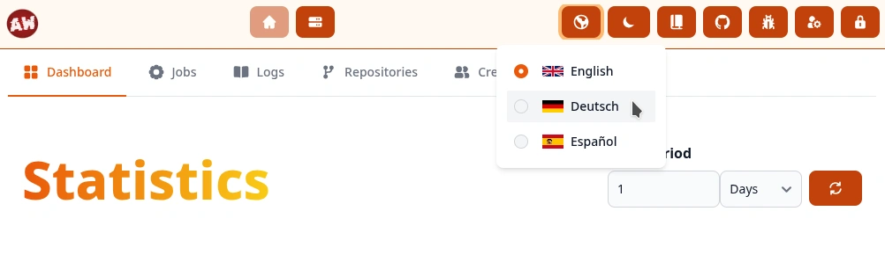

.. _usage_intro:

.. include:: ../_include/head.rst

=========
1 - Intro
=========

|intro_gif|

Comparison
**********

There are multiple Ansible WebUI products - how do they compare to this product?

* `Ansible AWX <https://www.ansible.com/community/awx-project>`_ / `Ansible Automation Platform <https://www.redhat.com/en/technologies/management/ansible/pricing>`_

   If you want an enterprise-grade solution - you might want to use these official products.

   They have many neat features and are designed to run in containerized & scalable environments.

   The actual enterprise solution named 'Ansible Automation Platform' can be pretty expensive.

* `Semaphore UI <https://github.com/semaphoreui/semaphore>`_

   Semaphore is a pretty lightweight WebUI for Ansible.

   It is a single binary and built from Golang (backend) and Node.js/Vue.js (frontend).

   Ansible job execution is done using `custom implementation <https://github.com/semaphoreui/semaphore/blob/develop/db_lib/AnsiblePlaybook.go>`_.

   The project is `managed by a single maintainer and has some issues <https://github.com/semaphoreui/semaphore/discussions/1111>`_. It seems to develop in the direction of large-scale containerized deployments.

   The 'Ansible-WebUI' project was inspired by Semaphore.

* **This project**

   It is built to be lightweight.

   As Ansible already requires Python3 - I chose it as primary language.

   The backend stack is built of `gunicorn <https://gunicorn.org/)/[Django](https://www.djangoproject.com/>`_ and the frontend consists of Django templates and vanilla JS/jQuery.

   Ansible job execution is done using the official `ansible-runner <https://ansible.readthedocs.io/projects/runner/en/latest/python_interface/>`_ library!

   Target users are small to medium businesses and Ansible users which just want a UI to run their playbooks.

----

Key Features
************

Simple but powerful
===================

No hurdles to get started! For a local single-user setup you do not need to care about a database or web-server.

You can get started it with **1 simple command**!

Scaling from a local single-user setup to a multi-user service is possible if required.

Lightweight
===========

This project has set it as a priority to stay as lightweight as possible.

It should be accessible for newcomers to Ansible.

It is built as Python 3 package, the same as `Ansible-Core <https://github.com/ansible/ansible>`_ and `Ansible-Runner <https://github.com/ansible/ansible-runner>`_ themself.

You can install it with **1 simple command**!

Responsive & Modern WebUI
=========================

By utilizing `SvelteJS <https://svelte.dev>`_, `TailwindCSS <https://tailwind.org>`_, `Flowbite-Svelte <https://flowbite-svelte.com/>`_ and an API-first design this WebUI user-friendly and responsive.

Documentation
=============

The best tool isn't usable without documentation.

We try to provide users with a good-quality documentation.

If you find any issues or have ideas on how to improve it: `Open a GitHub Issue <https://github.com/O-X-L/ansible-webui/issues>`_ or `Contact us directly <mailto:contact+ansible-webui@oxl.at>`_

Secure
======

Security is very important for a tool like this - which needs to process sensible system-access-credentials.

For more details see: :ref:`Usage - Security <usage_security>`

Job Scheduling
==============

If you want to use this Ansible-WebUI as a permanent service that auto-provisions systems - you can do so.

The backend has a built-in scheduler which can run many jobs at a time by utilizing multi-threading.

The actual Ansible-Executions are done in separate processes. (*Logic provided by the official Ansible-Runner module*)

Options for alerting on job-finish/-failure are available - see: `Usage - Alerts <usage_alerts>`_

Stability
=========

We make sure to test the main functionality of this application via automated tests:

* `API Integration Tests <https://github.com/O-X-L/ansible-webui/tree/latest/test/integration/api>`_
* `Authentication Integration Tests <https://github.com/O-X-L/ansible-webui/tree/latest/test/integration/auth>`_
* `Job-Execution Integration Tests <https://github.com/O-X-L/ansible-webui/tree/latest/test/integration/job-exec>`_
* `Web-Frontend Integration/E2E Tests <https://github.com/O-X-L/ansible-webui/tree/latest/test/integration/webui>`_
* `Database Integration Tests <https://github.com/O-X-L/ansible-webui/blob/latest/.github/workflows/test_dbs.yml>`_
* `Backend Unit-Tests <https://github.com/O-X-L/ansible-webui/blob/latest/.github/workflows/test_backend_unit.yml>`_ (*work in progress*)

If you have development experience => we are happy to get contributions for more test-cases! (:

Multi Language
==============

The WebUI has multi-language capabilities.

|language_dark|

|language_light|
