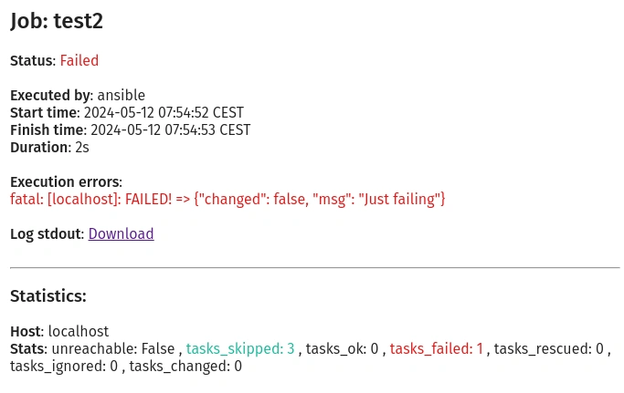
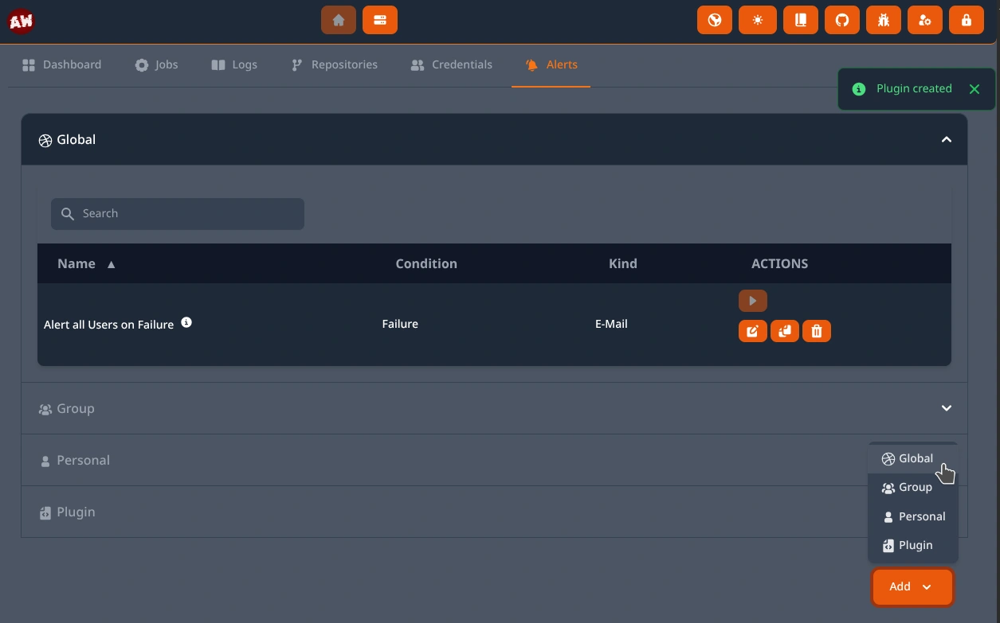
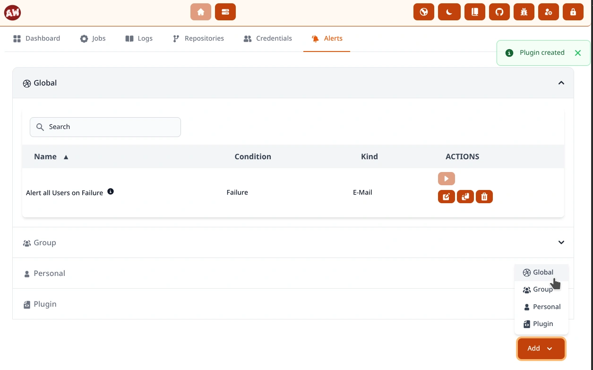

.. _usage_alerts:

.. include:: ../_include/head.rst

======
Alerts
======

You can use the UI at :code:`Home - Alerts` to create alerting rules for your jobs.

Options are:

* **User** specific rule - only you are notified

* **Group** rules - all members of a specific group are notified (*if they have the privilege to view the job*)

* **Global** rules - all users are notified (*if they have the privilege to view the job*)

There are currently two types of alerts: E-Mail and custom plugins.

|alert_ui_dark|

|alert_ui_light|

----

E-Mail
******

You need to configure your mailserver at the :code:`System - Settings` page.

After that you can send e-mails on job finish and/or failure.

You can modify the email templates by setting the :code:`Template Directory` in your system config. If you want to do so - copy `the existing templates <https://github.com/O-X-L/ansible-webui/tree/latest/src/oxl_ansible_webui/aw/templates/email>`_ and modify them as needed. Note: the `Django template syntax <https://docs.djangoproject.com/en/5.0/ref/templates/language/>`_ is required. No external css is supported.

**Example Mail**:

|alert_email|

----

Plugins
*******

There is a generic alert-plugin interface for custom solutions.

**Usage**:

* Create a script that can be called by AW

  It will receive a file-path as system-argument #1 that points to a JSON file containing data you might want to use.

  Example: `Alert Plugin Example <https://github.com/O-X-L/ansible-webui/tree/latest/examples/plugins/alert_plugin_example.json>`_

* Create a plugin at :code:`Home - Alerts` that points to your executable

* Link the plugin in alerts

* You can use the user-attributes :code:`phone` and :code:`description` to add user-specific information your script might need.

* Test it

**Example plugins** can be found (and contributed to) `in the Repository <https://github.com/O-X-L/ansible-webui/tree/latest/examples/plugins>`_.
