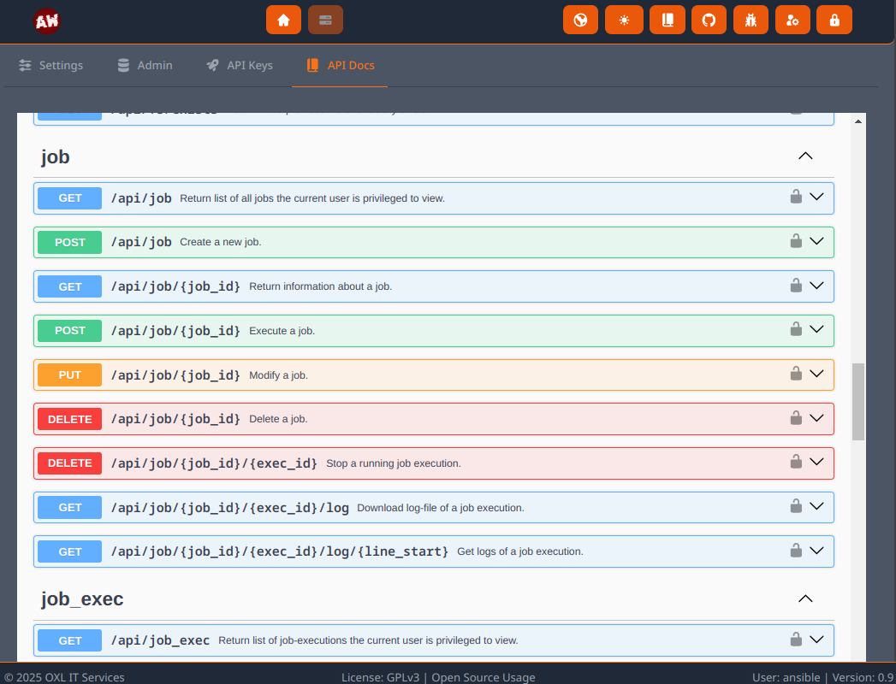

.. _usage_api:

.. include:: ../_include/head.rst

===
API
===

This project has a API first development approach!

To use the API you have to create an API key. You can use the UI at :code:`System - API Keys` to do so.

You can also create API keys using the CLI: :code:`oxl-ansible-webui-cli -a api-key.create -p <USER>`

Examples
********

Requests must have the API key set in the :code:`X-Api-Key` header.

.. code-block:: bash

    # list own api keys
    curl -X 'GET' 'http://localhost:8000/api/key' -H 'accept: application/json' -H "X-Api-Key: <KEY>"
    > {"tokens":["ansible-2024-01-20-16-50-51","ansible-2024-01-20-16-10-42"]}

    # list jobs
    curl -X 'GET' 'http://localhost:8000/api/job' -H 'accept: application/json' -H "X-Api-Key: <KEY>"
    > [{"id":34,"name":"Deploy App","inventory":"inventories/dev/hosts.yml","playbook":"app.yml","schedule":"22 14 * * 4,5","limit":"dev1,dev3","verbosity":0,"comment":"Deploy my app to the first two development servers","environment_vars":"MY_APP_ENV=DEV,TZ=UTC"}]

    # execute job
    curl -X 'POST' 'http://localhost:8000/api/job/34' -H 'accept: application/json' -H "X-Api-Key: <KEY>"
    > {"msg":"Job 'Deploy App' execution queued"}

    # Ansible-vault-encrypt data
    curl -s -X 'POST' 'http://localhost:8000/api/credentials/vault_encrypt' -H 'Content-Type: application/json' -H "X-Api-Key: ${API_TOKEN}" --data '{"credentials_id": 1, "credentials_type": "shared", "plaintext": "testSecret"}' | jq
    > {
    >   "msg": "Successfully Ansible-Vault-encrypted data",
    >   "ciphertext": "!vault |\n          $ANSIBLE_VAULT;1.1;AES256\n          63323262306230383434316366333364643937323339633863646536623730303833613466343566\n          3763663732383437646236653066376362666133313933330a363930633461656430373134336536\n          37346534626564646339343436633139326536666464613032353037373235323066363833343566\n          3264366333303731320a663361306535306566393739656465313330613461346439636134386134\n          3362"
    > }

API Docs
********

You can see the available API-endpoints in the built-in API-docs at :code:`System - API Docs` (*swagger*)

|api_docs|
