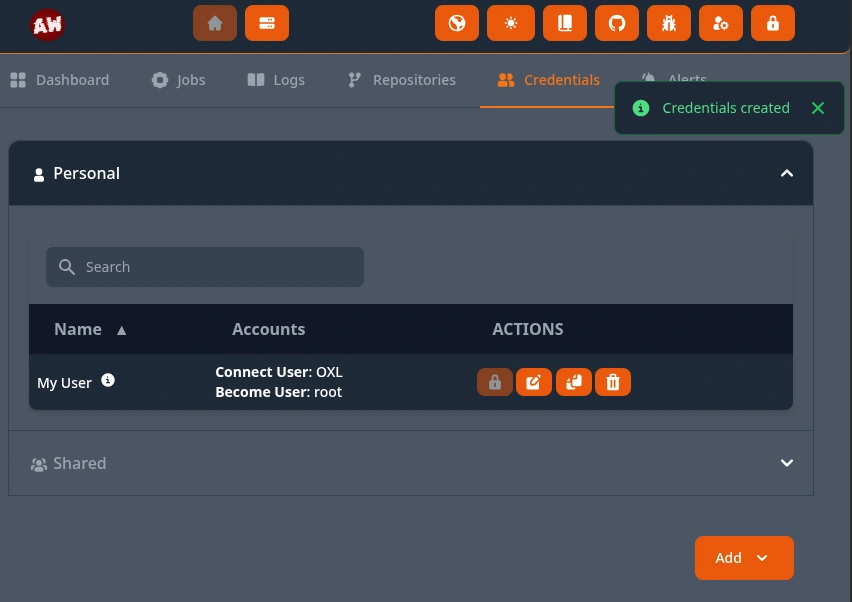
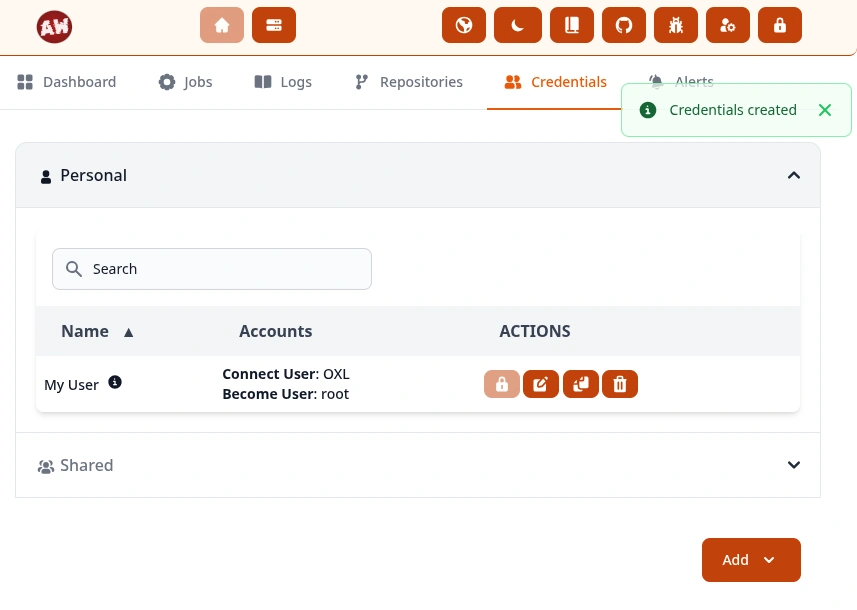
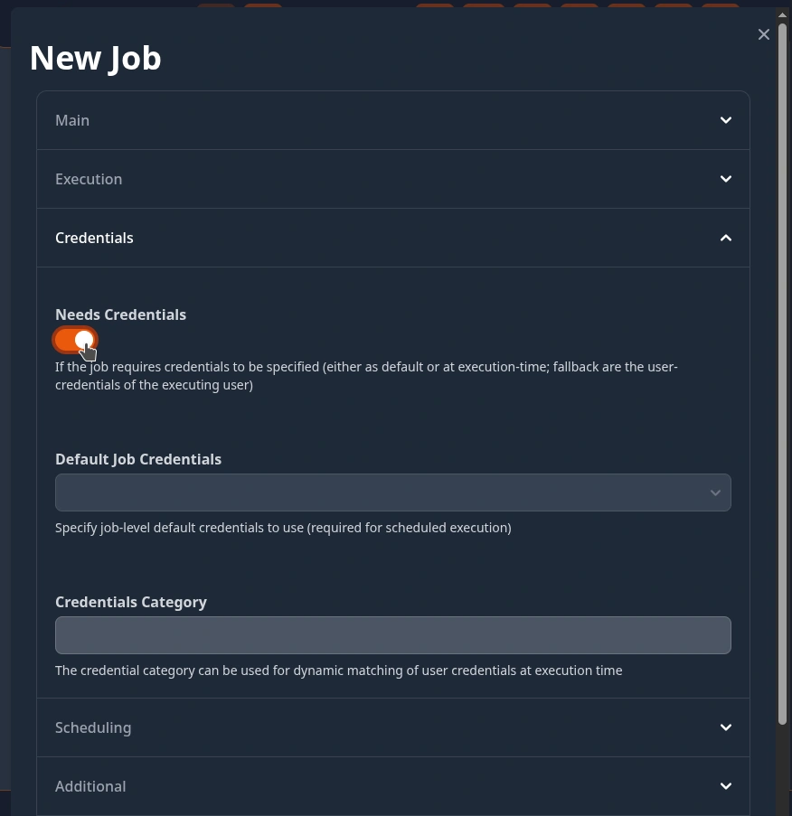
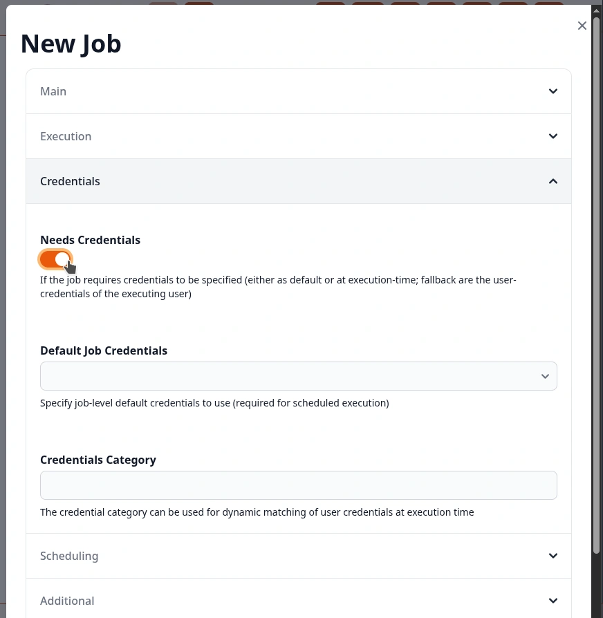
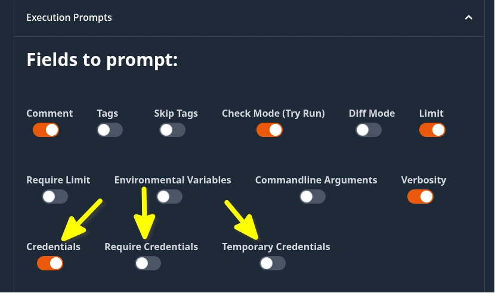
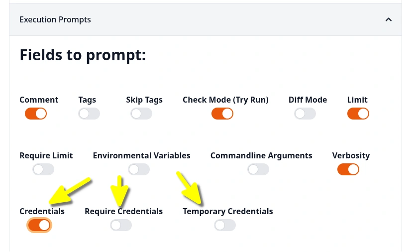
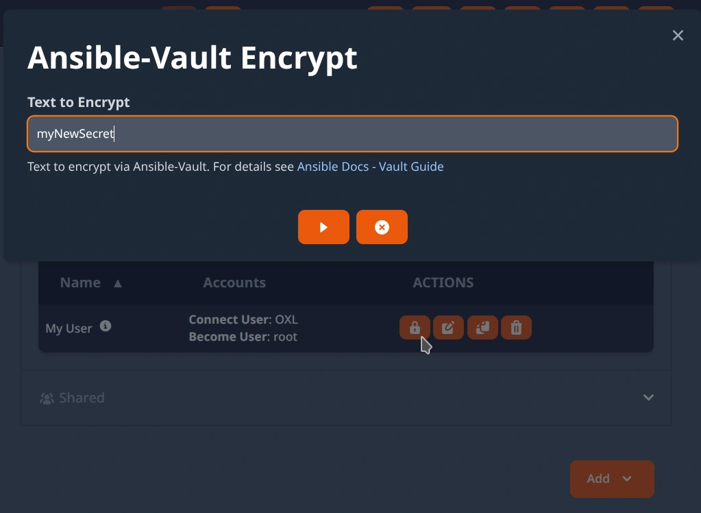
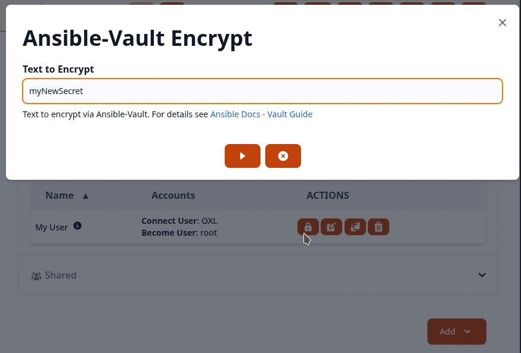
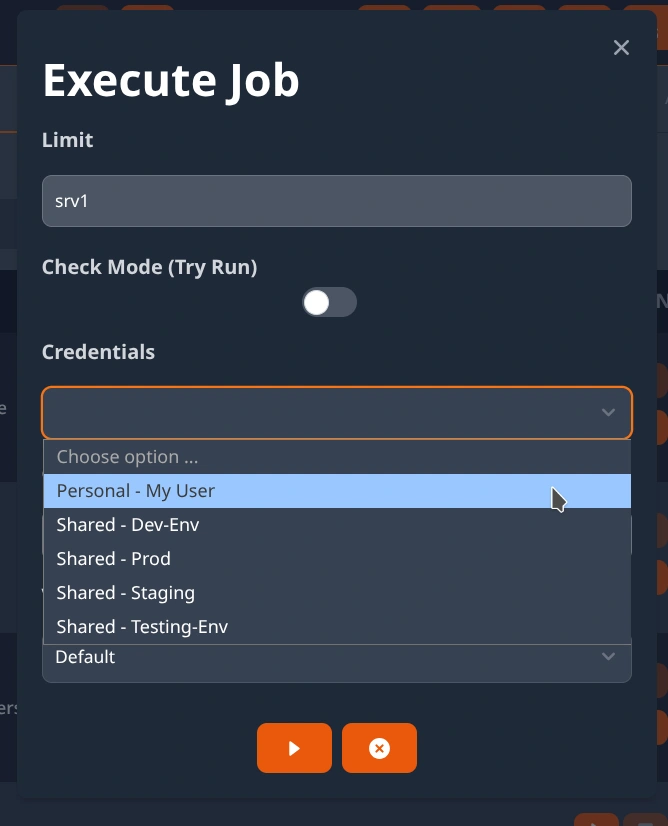
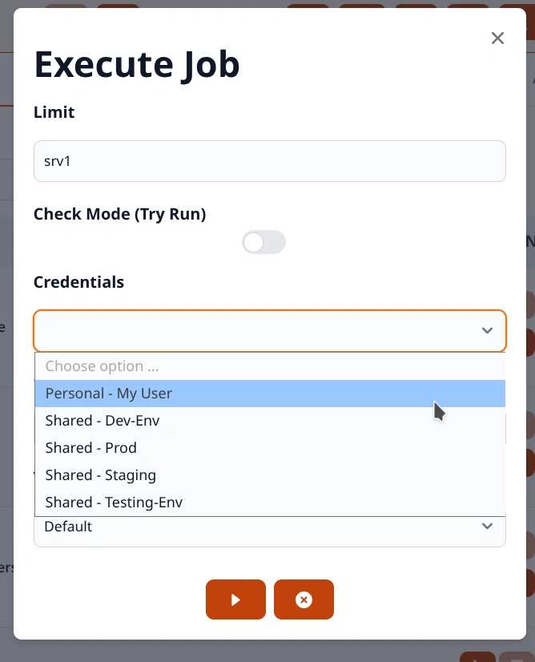

.. _usage_credentials:

.. include:: ../_include/head.rst

.. |creds_tmp_dark| image:: ../_static/img/credentials_tmp_dark.webp
   :class: wiki-img-xs-dark

.. |creds_tmp_light| image:: ../_static/img/credentials_tmp_light.webp
   :class: wiki-img-xs-light

===========
Credentials
===========

You can define :code:`global` and :code:`user` credentials.

The saved credential secrets are never returned to the user/Web-UI! They are saved encrypted to the database!

The UI at :code:`Home - Credentials` allows you to manage them.

|creds_ui_dark|

|creds_ui_light|

----

Job Execution
#############

Requirement
***********

You can configure a job to require credentials:

|creds_job_dark|

|creds_job_light|

**Prompt options**:

* :code:`Credentials` => Prompt for which User/Shared-Credentials to use

* :code:`Require Credentials` => Do not allow WebUI execution without the user selecting/providing credentials

* :code:`Temporary Credentials` => Allow the user to provide credentials that will only be available for this execution

|creds_prompt_dark|

|creds_prompt_light|

Supplying them
**************

Whenever a job is executed **that requires credentials** - you have multiple ways of supplying them:

* Choose from previously **saved credentials** in the Job-Execution-Form

  |job_exec_creds_dark|

  |job_exec_creds_light|

* Supply **temporary Credentials** in the Job-Execution-Form

  **Security**: These credentials are only accessible to AW for one job-execution. They are inaccessible after the execution started.

  |creds_tmp_dark|

  |creds_tmp_light|

* If the job is ran on a schedule - the job has to be configured with **Shared Credentials** that should be used.

* If a job is executed manually by a user and no credentials are chosen/supplied - the job checks if the user has any personal credentials.

  * If the user has multiple ones and the job has a **Credentials Category** configured - it will use the credentials that match the category.

  * If no category was configured or it could not be matched - the first user-credentials are used.

  * If the user has no personal credentials - the execution fails.

----

Kinds
#####

Shared
******

Shared credentials can be used for **scheduled job executions**.

Users that are members of the :code:`AW Credentials Managers` group are able to create and manage shared credentials.

Access to shared credentials can be controlled using :ref:`permissions <usage_permission>`.

* Whenever jobs are executed by a user (*via WebUI or API*) AW verifies that the user is actually permitted to use the credentials.

* Whenever jobs are created or modified - the modifying user is set as job-owner.

  When executing jobs on a schedule - AW verifies that this job-owner is permitted to use the configured credentials.

  If a job-owner gets deleted - the linked scheduled jobs will get denied access to any credentials.

----

Personal
********

User credential can only be used and accessed by the user that created them.

Job executions:

* the user-credentials matching the jobs :code:`credential category`

* or the first user-credentials found as a fallback in case no other credentials were provided/configured

----

Ansible-Vault Encrypt
#####################

Users are able to Ansible-Vault encrypt text if they have read-privileges on credentials that have a Vault-Password, Vault-File or Vault-ID defined.

This is especially useful if users should not be able to read the Vault-Password(s) but have to encrypt new secrets used in roles.

|creds_vault_dark|

|creds_vault_light|
