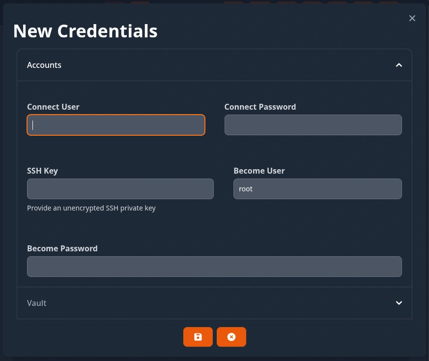
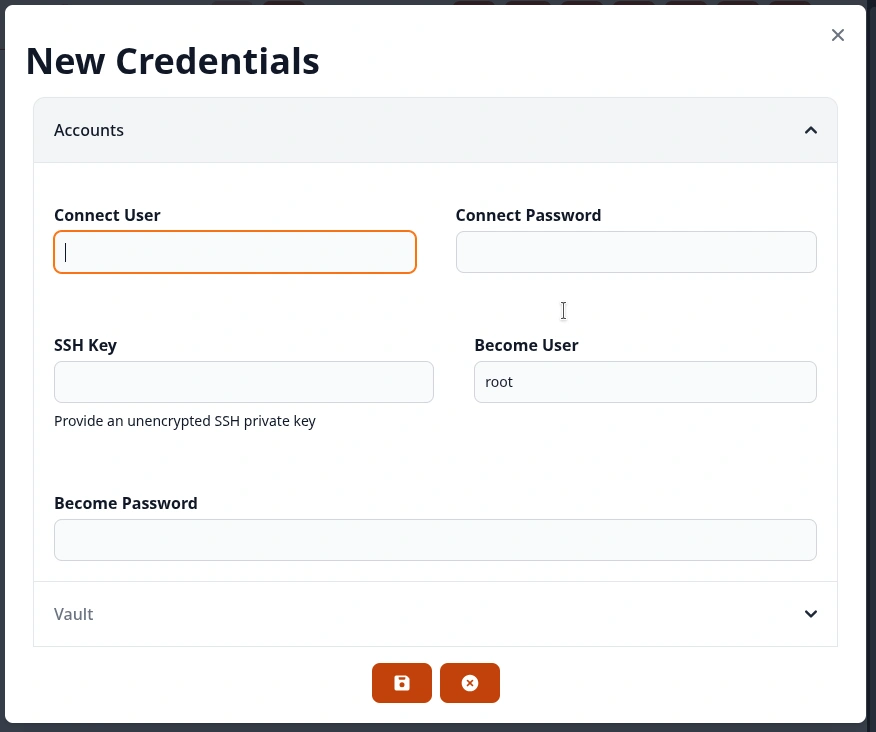

.. _usage_credentials:

.. include:: ../_include/head.rst

.. |creds_ui_dark| image:: ../_static/img/credentials_ui_dark.webp
   :class: wiki-img-dark

.. |creds_ui_light| image:: ../_static/img/credentials_ui_light.webp
   :class: wiki-img-light

.. |creds_job_dark| image:: ../_static/img/credentials_job_dark.webp
   :class: wiki-img-dark

.. |creds_job_light| image:: ../_static/img/credentials_job_light.webp
   :class: wiki-img-light

.. |creds_prompt_dark| image:: ../_static/img/credentials_prompt_dark.webp
   :class: wiki-img-dark

.. |creds_prompt_light| image:: ../_static/img/credentials_prompt_light.webp
   :class: wiki-img-light

.. |creds_tmp1_dark| image:: ../_static/img/credentials_tmp1_dark.webp
   :class: wiki-img-xs-dark

.. |creds_tmp1_light| image:: ../_static/img/credentials_tmp1_light.webp
   :class: wiki-img-xs-light

.. |creds_vault_dark| image:: ../_static/img/credentials_vault_encrypt_dark.webp
   :class: wiki-img-dark

.. |creds_vault_light| image:: ../_static/img/credentials_vault_encrypt_light.webp
   :class: wiki-img-light

===========
Credentials
===========

You can define :code:`global` and :code:`user` credentials.

The saved credential secrets are never returned to the user/Web-UI! They are saved encrypted to the database!

The UI at :code:`Home - Credentials` allows you to manage them.

|creds_ui_dark|

|creds_ui_light|

Global Credentials
******************

Global credentials can be used for scheduled job executions.

Users that are members of the :code:`AW Credentials Managers` group are able to create and manage global credentials.

Access to global credentials can be controlled using :ref:`permissions <usage_permission>`.

* Whenever jobs are executed by a user (*via WebUI or API*) AW verifies that the user is actually permitted to use the credentials.

* Whenever jobs are created or modified - the modifying user is set as job-owner.

  When executing jobs on a schedule - AW verifies that this job-owner is permitted to use the configured credentials.

  If a job-owner gets deleted - the linked scheduled jobs will get denied access to any credentials.

----

User Credentials
****************

User credential can only be used and accessed by the user that created them.

Jobs that are executed by an user will use: (*if the job is set to need credentials*)

* the user-credentials matching the jobs :code:`credential category`

* or the first user-credentials found as a fallback in case no other credentials were provided/configured

----

Jobs
****

You can define if a job needs credentials to run:

|creds_job_dark|

|creds_job_light|

You also have some options on how credentials may be provided at the execution-prompts:

* :code:`Credentials` => Prompt for which User/Shared-Credentials to use
* :code:`Require Credentials` => Do not allow WebUI execution without the user selecting/providing credentials
* :code:`Temporary Credentials` => Allow the user to provide credentials that will only be available for this execution

|creds_prompt_dark|

|creds_prompt_light|

Temporary credentials can be used to manually provide credentials for one execution. They are deleted afterwards.

|creds_tmp1_dark|

|creds_tmp1_light|

|creds_tmp2_dark|

|creds_tmp2_light|

----

Ansible-Vault Encrypt
*********************

Users are able to Ansible-Vault encrypt plaintext if they have read-privileges on credentials that have a Vault-Password, Vault-File or Vault-ID defined.

This is especially useful if users should not have access to the Vault-Password(s) but have to encrypt new secrets used in roles.

|creds_vault_dark|

|creds_vault_light|
