.. _usage_jobs:

.. include:: ../_include/head.rst

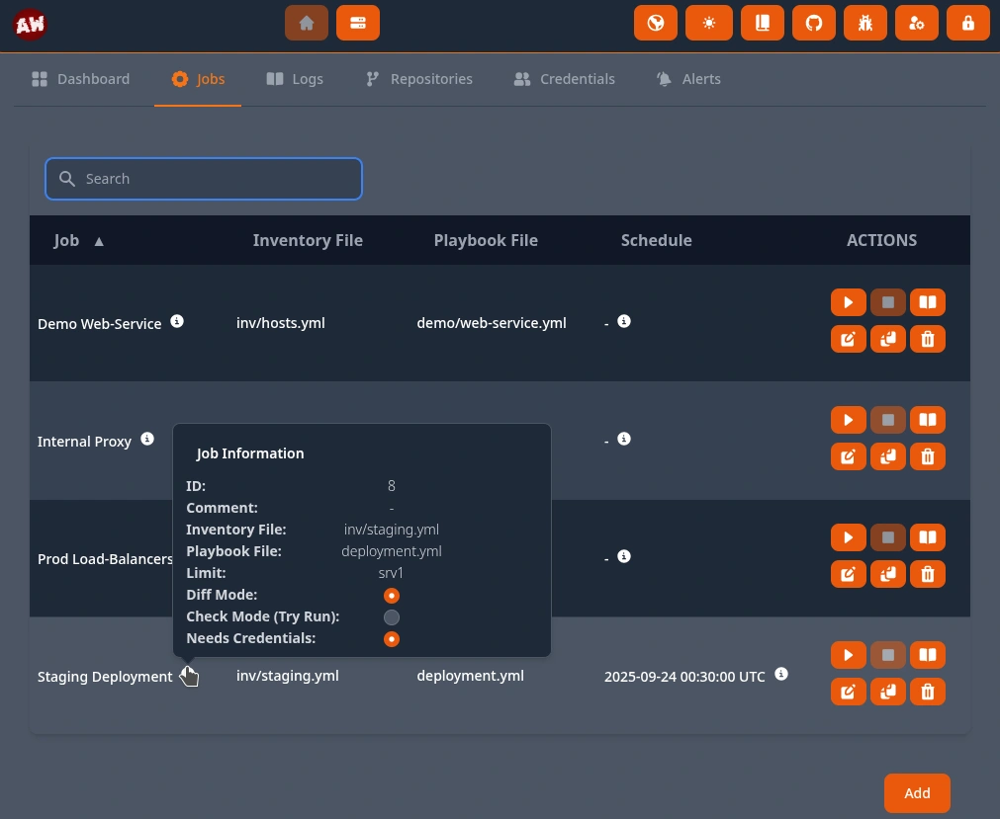

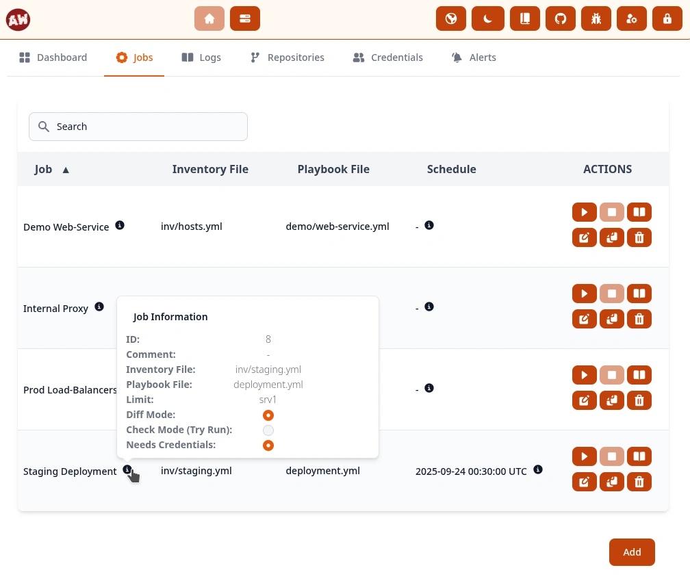

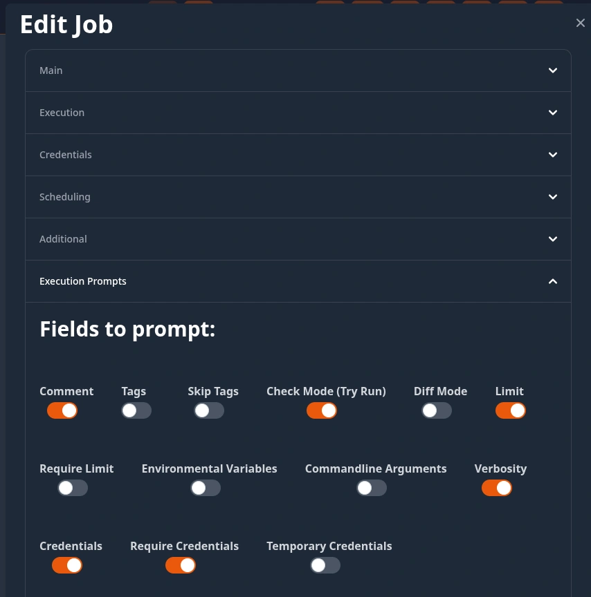

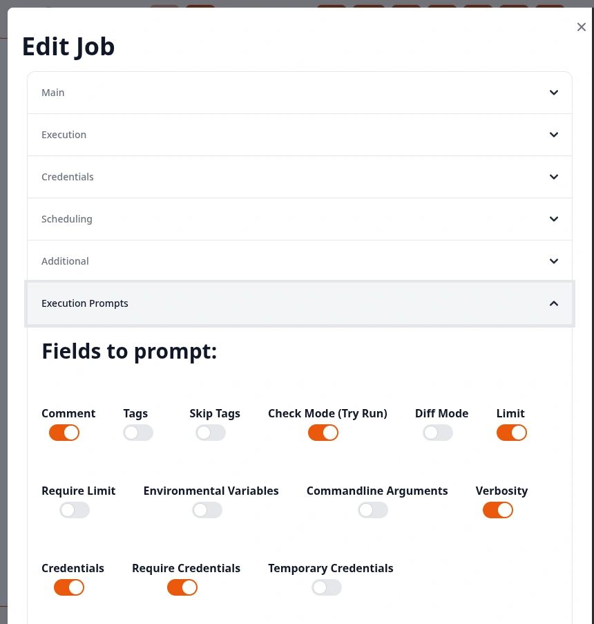

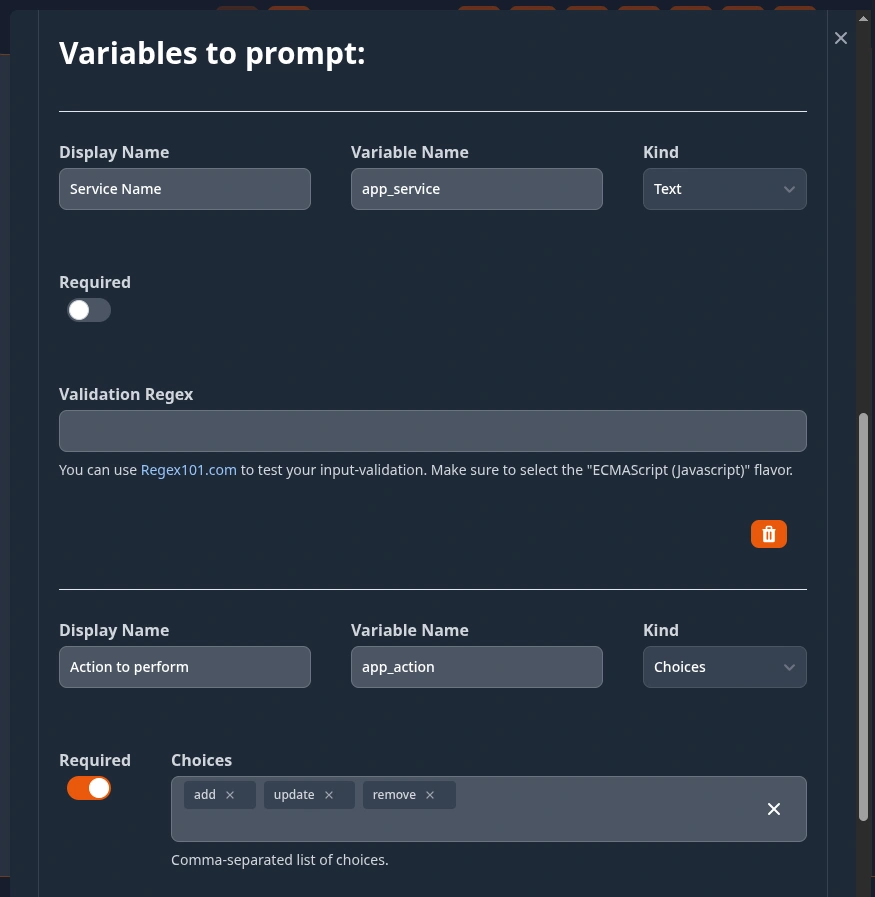

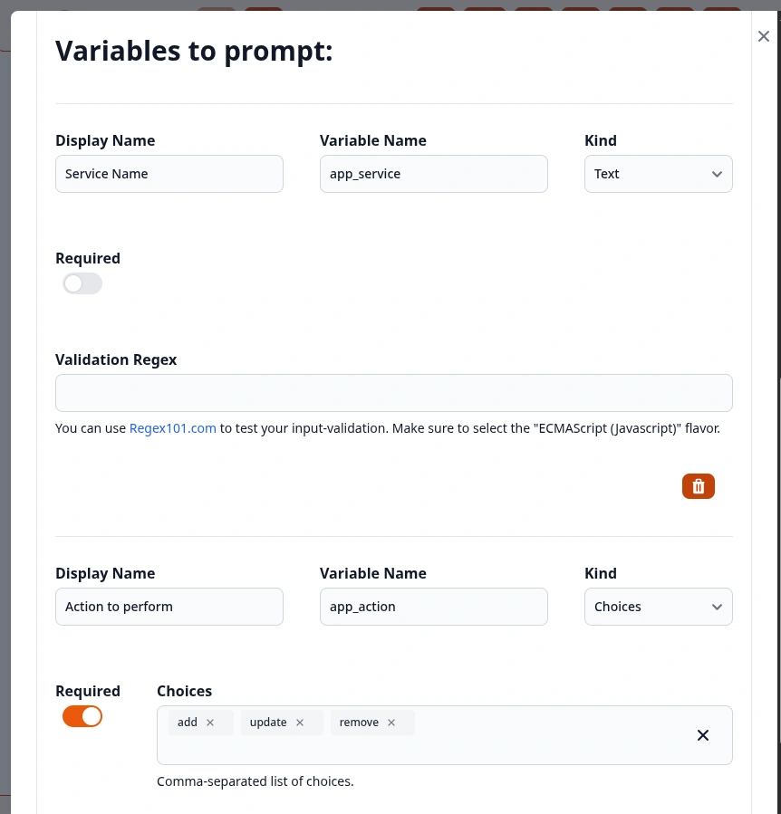

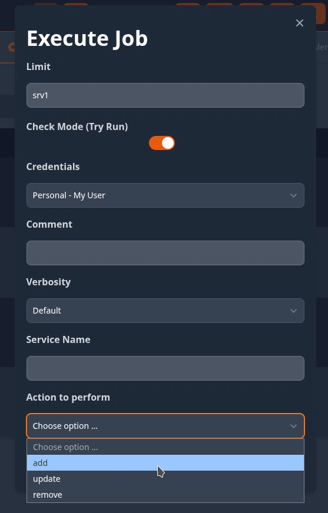

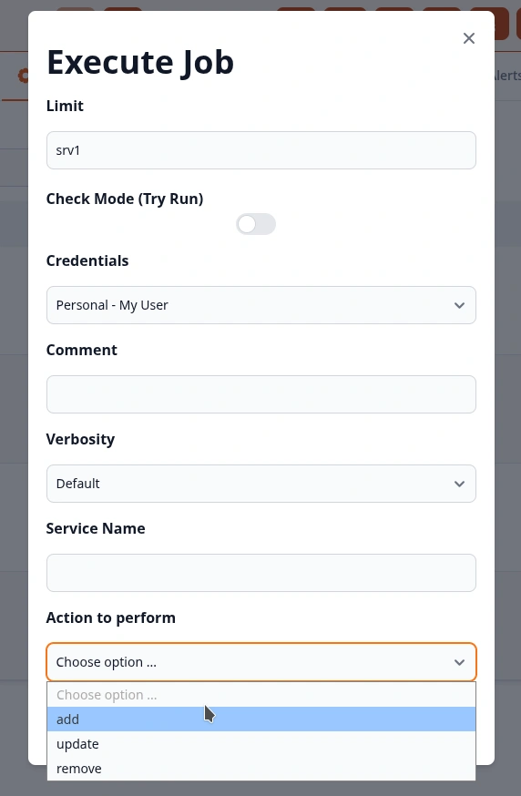

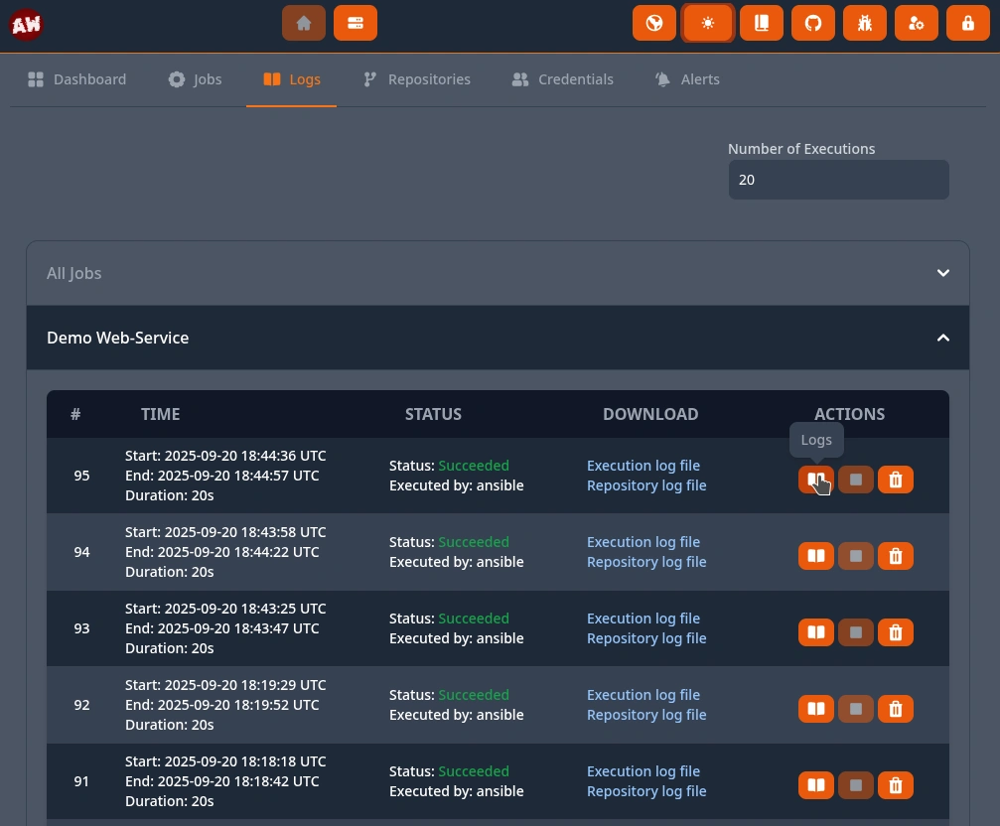

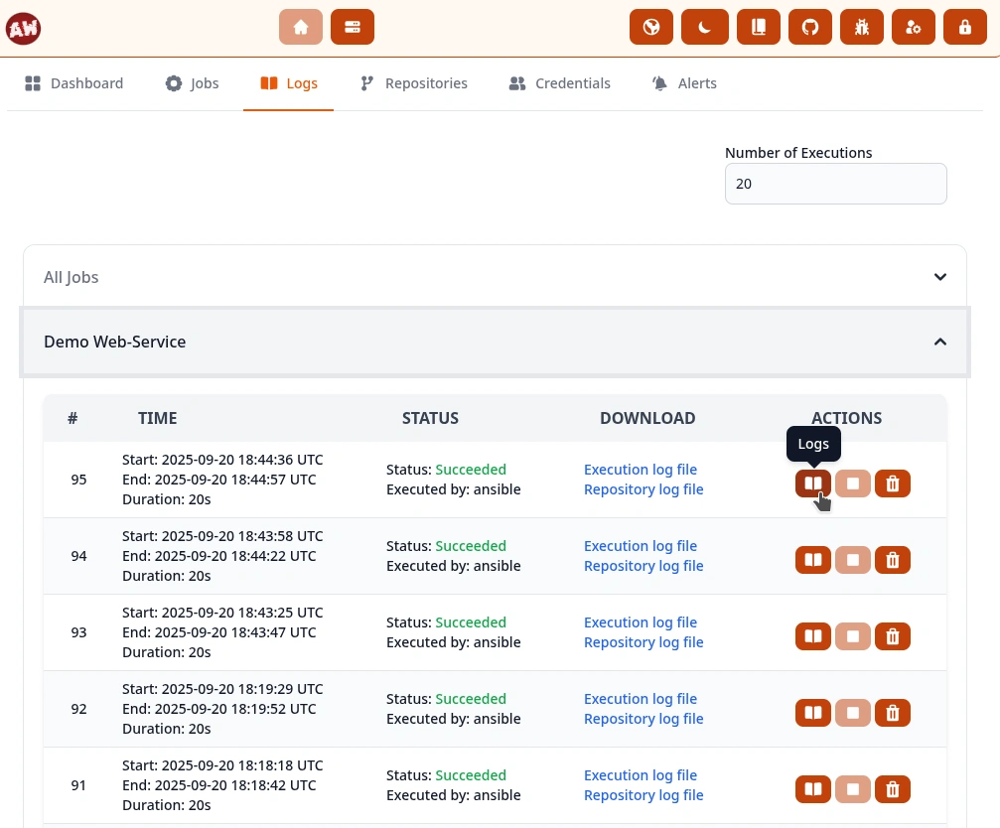

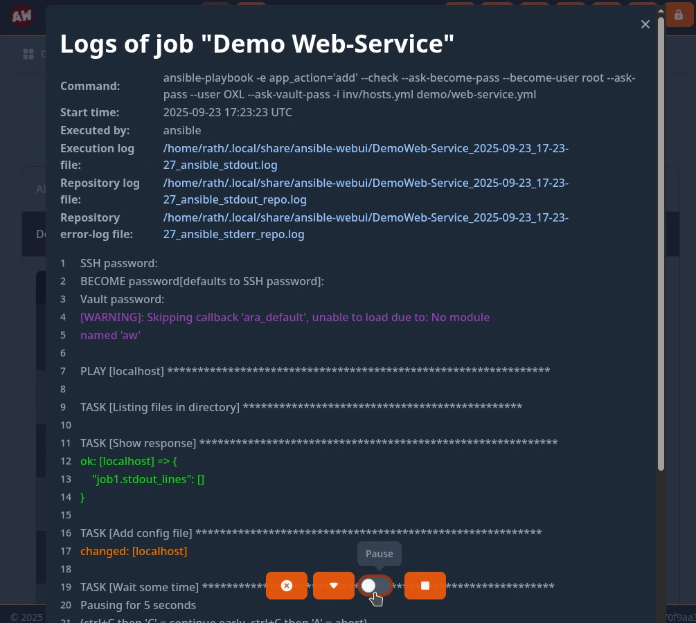

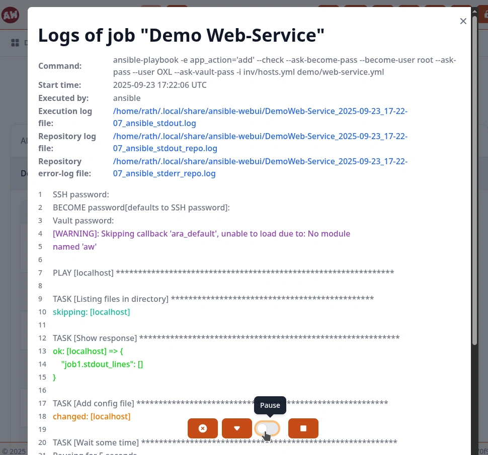

====
Jobs
====

You can use the UI at :code:`Home - Jobs` to create and execute jobs.

|jobs_ui_dark|

|jobs_ui_light|

----

Create
******

To get an overview - Check out the demo at: `demo.ansible-webui.OXL.app <https://demo.ansible-webui.OXL.app>`_ | Login: User :code:`demo`, Password :code:`Ansible1337`

The job creation form will help you by browsing for playbooks and inventories. For this to work correctly - you should first select the repository to use (*if any is in use*).

You can optionally define a :code:`schedule` in `Cron-format <https://crontab.guru/>`_ to automatically execute the job. Schedule jobs depend on :ref:`Global Credentials <usage_credentials>` (*if any are needed*).

:code:`Credential categories` can be defined if you want to use user-specific credentials to manage your systems. The credentials of the executing user will be dynamically matched if the job is set to :code:`Needs credentials`.

For transparency - the full command that is executed is added on the logs-view.

----

Execute
*******

You have two options to execute a job:

* **Quick execution** - run job as configured without overrides

* **Custom execution** - run job with execution-specific overrides

    The fields available as overrides can be configured in the job settings!

    |job_prompts_1_dark|

    |job_prompts_1_light|

    |job_prompts_2_dark|

    |job_prompts_2_light|

    These will be shown in the job overview:

    |job_exec_dark|

    |job_exec_light|

----

Logs
****

Via the **Logs** Tab you can view the output of your jobs:

|logs_ui_dark|

|logs_ui_light|

You are also able to follow the live-output-stream of running jobs - and perform actions like stopping the job ad-hoc:

|logs_live_light|

|logs_live_dark|

----

Options
*******

These are the options you can configure for your jobs.

Main
====

* **NAME**:

  Required. Give the job a name you like.

* **COMMENT**:

  Optional. Add a comment to your job.

* **REPOSITORY**:

  Optional. Choose a Repository as your Ansible-Playbook directory. If none is chosen the current working-directory of the Ansible-WebUI will be used.

* **PLAYBOOK FILE**:

  Required. The Ansible-Playbook to execute.

* **INVENTORY FILE**:

  Optional. The Ansible-Inventory to use. Leave it empty if you are using a :code:`dynamic inventory` or want to cover some special-case using the :code:`Additional - Commandline Arguments`.

Execution
=========

* **LIMIT**:

  Optional. Supply a limit for the Ansible execution.

* **TAGS**:

  Optional. Supply tags for the Ansible execution.

* **SKIP TAGS**:

  Optional. Supply skip-tags for the Ansible execution.

* **DIFF MODE**:

  En- or disable the Ansible Difference-Mode.

* **CHECK MODE (Try Run)**:

  En- or disable the Ansible Check-Mode.

* **VERBOSITY**:

  Choose the Ansible output-verbosity.

Credentials
===========

* **NEEDS CREDENTIALS**:

  If the job should require credentials to be provided. Either via job-options or at execution-time by the user.

* **DEFAULT JOB CREDENTIALS**:

  Optional. The job-credentials that should be used. If the user chooses other credentials at execution-time - they will be used instead. Default-credentials are required if you want to run the job via schedule in the background!

* **CREDENTIALS CATEGORY**:

  Optional. If the job is designed to be ran as user - this category can be used to auto-match user-credentials for the job without the user needing to manually select them.

  An example would be: Create user-credentials for the category 'internal systems' and configure the job to be ran with 'internal systems' credentials.

Scheduling
==========

* **SCHEDULE**:

  Optional. A schedule on which the job should be automatically executed in the background. You need to use the `Cron-Format <https://crontab.guru/>`_.

  If you are running the Ansible-WebUI with the (*default*) SQLite database - you should leave a few minutes between executions as too many database write-operations at once could lead to issues.

* **SCHEDULE ENABLED**:

  If a schedule was configured - you are able to disable it with this switch.

Additional
==========

* **ENVIRONMENTAL VARIABLES**:

  Optional. You can provide simple environmental variables that should be added to the job execution. They need to be comma-separated.

  Example: :code:`APP_ENV=DEVELOPMENT,WEBSERVER=nginx`

  Hint: You can also provide env-vars to use for ALL jobs using the :code:`System - Settings`

* **COMMANDLINE ARGUMENTS**:

  Optional. You can add additional arguments to the :code:`ansible-playbook ...` command via this option. This allows you to cover special-cases.

  Example: Use simple IPs instead of an inventory - :code:`-i 192.0.2.5,192.0.2.6,192.0.2.7,`

* **SSH HOSTKEYS**:

  Optional. You can choose a SSH-Hostkey known_hosts-file to be used for this job.

  The :code:`System - SSH Hostkeys` page allows you to add and manage hostkeys.

Execution Prompts
=================

* **FIELDS TO PROMPT**:

  Choose which options/fields should be shown to the user in the manual/custom execution-dialogue.

* **VARIABLES TO PROMPT**:

  Optional. Add custom prompts for Ansible-Variables. They will be added to the Ansible execution via :code:`ansible-playbook ... -e "<var>='<value>'"`.

  * **DISPLAY NAME**: The name of the field in the execution dialogue
  * **VARIABLE NAME**: The name of the ansible-variable
  * **KIND**: Currently you can choose between :code:`Text` and :code:`Choices`.
  * **REQUIRED**: If the user is required to fill-out this field in the execution dialogue
  * **VALIDATION REGEX**: :code:`Text` input can be validated via a Regex-pattern.
  * **CHOICES**: Provide the :code:`Choices` from which the user should be able to select an option.

----

Metadata
********

AW will pass some meta-data about it's execution-context to Ansible via environmental-variables:

* :code:`AW_OWNER_USER` => Username of the job owner
* :code:`AW_OWNER_EMAIL` => E-Mail Address of the job owner
* :code:`AW_EXECUTION_USER` => Username of the executing user
* :code:`AW_EXECUTION_EMAIL` => E-Mail Address of the executing user
