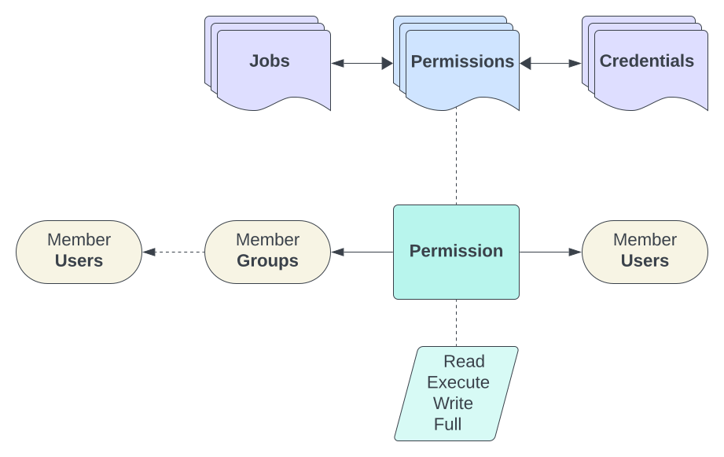

.. _usage_permission:

.. include:: ../_include/head.rst

==========
Privileges
==========

.. warning::

    The current version of this Ansible-WebUI has NOT YET IMPLEMENTED a complete permission system.

    See also: `GitHub issue #15 <https://github.com/O-X-L/ansible-webui/issues/15>`_

----

Managers
********

To allow a users to perform management actions - add them to the corresponding system-group.

Available ones are:

* :code:`AW Job Managers` - create new jobs, view and update all existing ones

* :code:`AW Permission Managers` - create, update and delete permissions

* :code:`AW Repository Managers` - create new repositories, view and update all existing ones

* :code:`AW Credentials Managers` - create new global credentials, view and update all existing ones

* :code:`AW System Managers` - configure system settings

----

|perm_overview|
