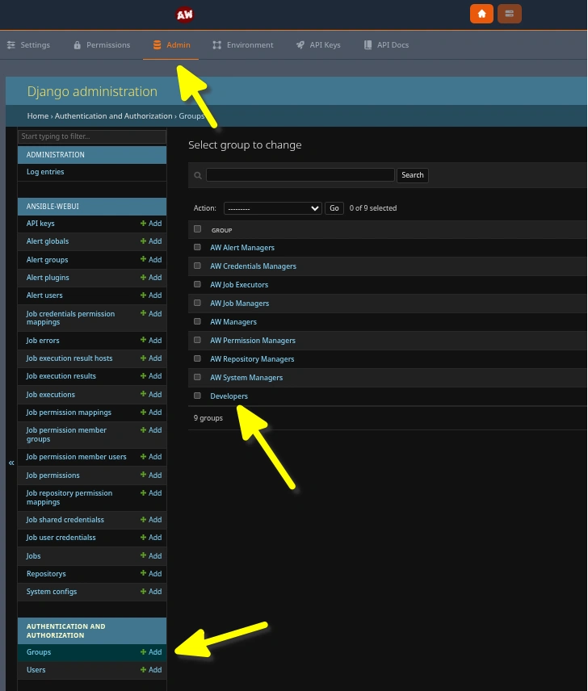
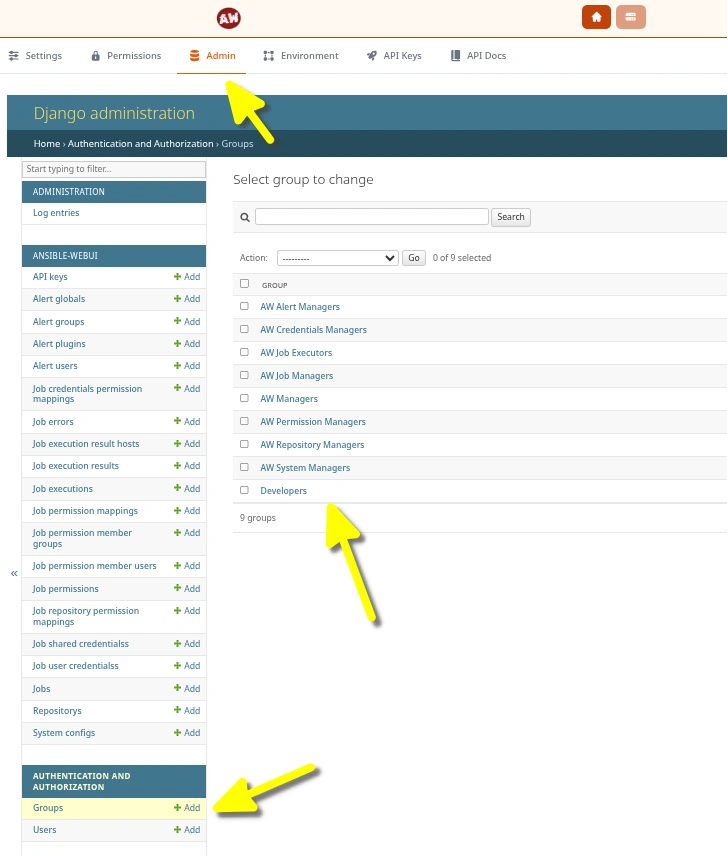
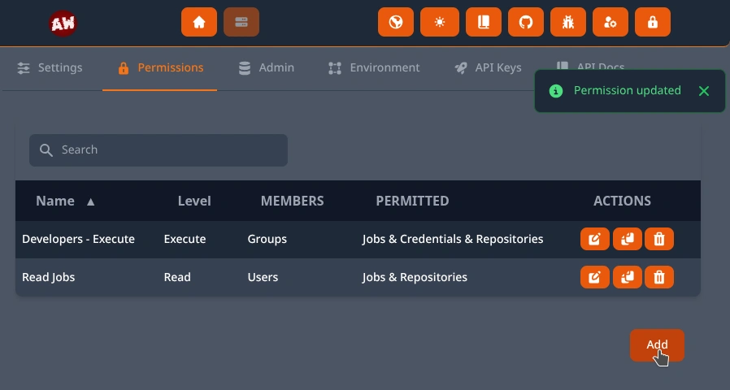
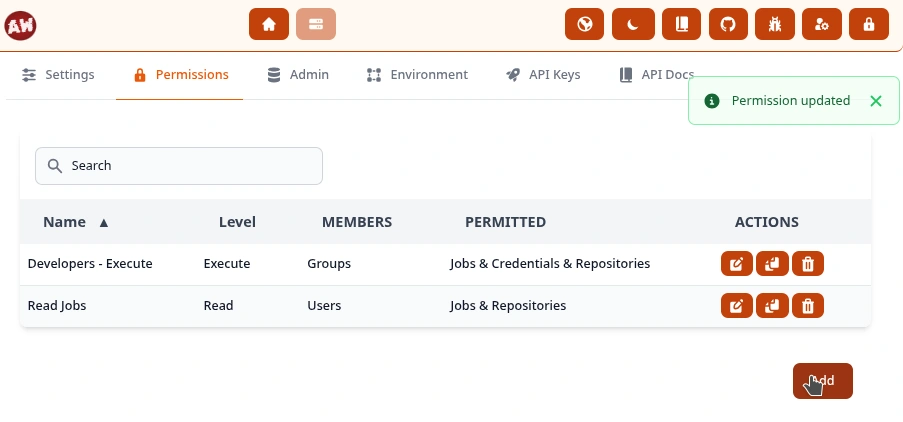
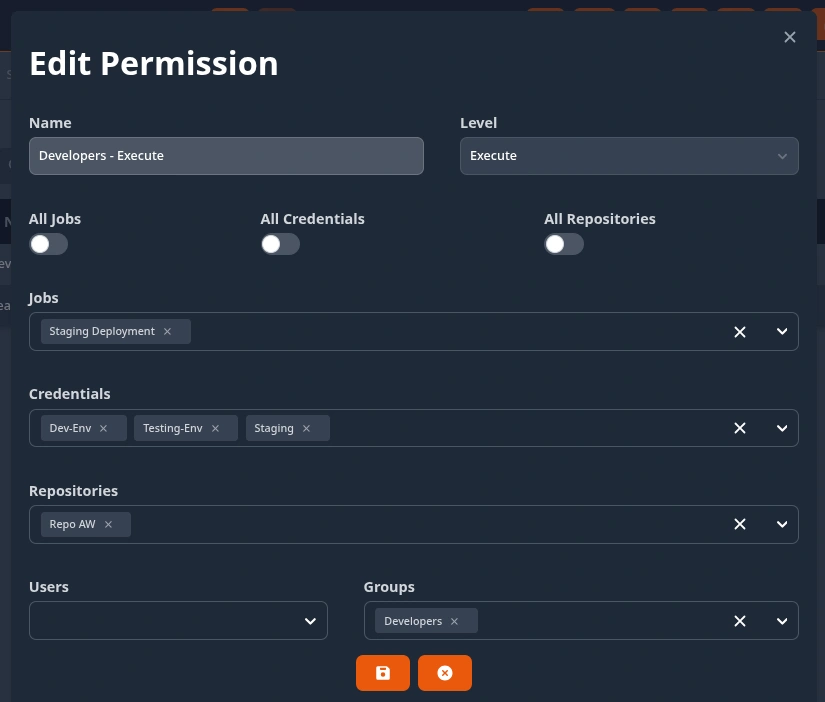
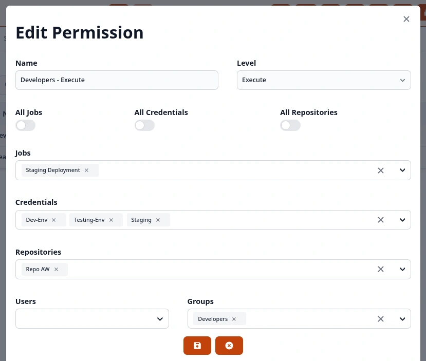

.. _usage_permission:

.. include:: ../_include/head.rst

.. |perm_overview| image:: ../_static/img/permission_overview.svg
   :class: wiki-img-sm

==========
Privileges
==========

Users & Groups
##############

This system utilizes the Authentication-System of the `Django Framework <https://docs.djangoproject.com/en/5.2/topics/auth/default/>`_.

You can manage users, create groups and assign group-membership at the **System - Admin** page.

If you are using :ref:`SAML Authentication <administration_auth_saml>` you can map SAML-groups to internal ones!

|admin_groups_dark|

|admin_groups_light|

----

Permissions
###########

The permission-system allows you to grant a specific access-level for users and/or groups to jobs, repositories and credentials.

|perm_ui_dark|

|perm_ui_light|

|perm_edit_dark|

|perm_edit_light|

Levels
******

There are 5 permission levels:

* **None** - Permission is ignored

* **Read** - Members are able to read config & credentials but not execute jobs & repositories

* **Execute** - Read + Execute jobs & repositories

* **Write** - Read + Execute + Edit configuration of entries

* **Full** - Read + Execute + Write + Delete entries

|perm_overview|

----

Managers
########

Besides the explicit permissions - you can assign users to **Manager** groups at the **System - Admin** page.

Available ones are:

* :code:`AW Job Managers` - create new jobs, view and update all existing ones

* :code:`AW Job Executors` - read and execute all existing jobs

* :code:`AW Permission Managers` - create, update and delete permissions

* :code:`AW Repository Managers` - create new repositories, view and update all existing ones

* :code:`AW Credentials Managers` - create new global credentials, view and update all existing ones

* :code:`AW Alert Managers` - create new global- & group-alerts, view and update all existing ones

* :code:`AW System Managers` - configure system settings

* :code:`AW Managers` - equivalent of being a member of all of the groups listed above
