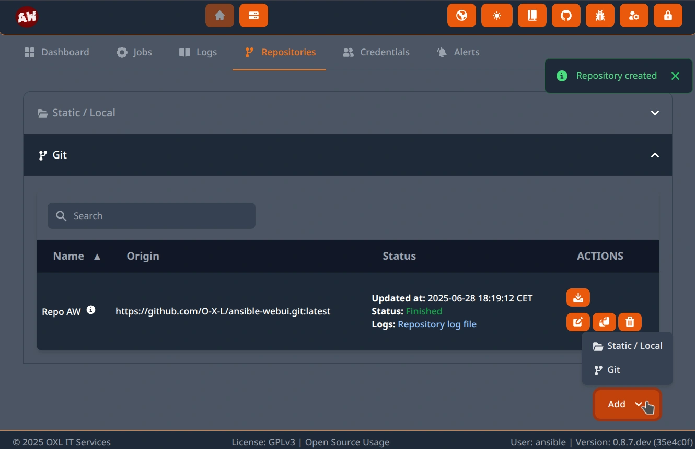
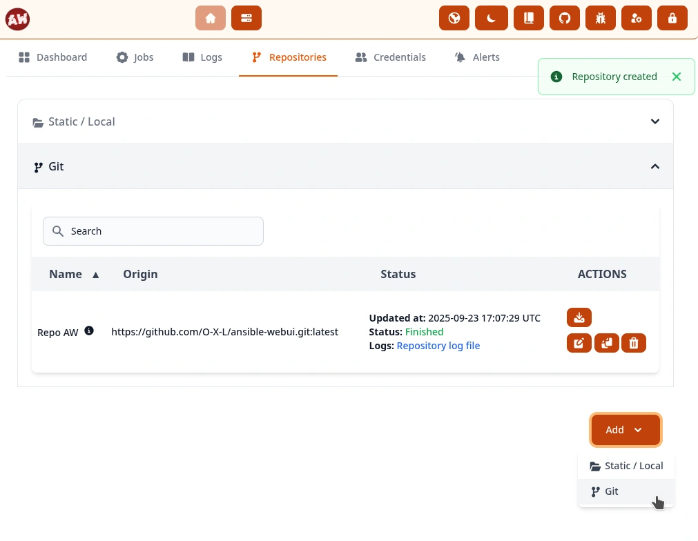
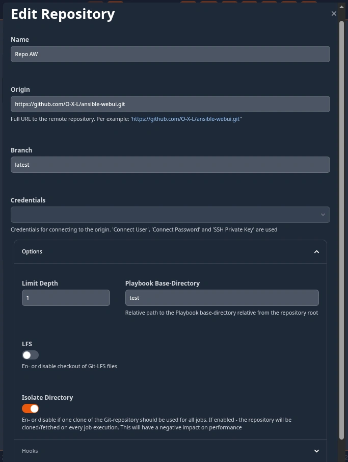
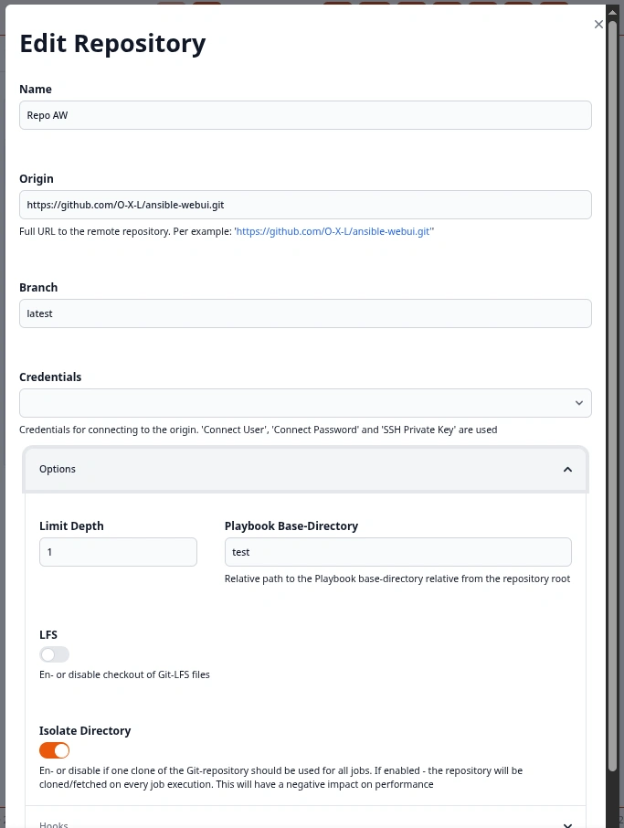

.. _usage_repositories:

.. include:: ../_include/head.rst

============
Repositories
============

You are able to create multiple Repositories that act as Ansible-Playbook base-directories.

If you are new to Ansible - make sure to read the `official Documentation covering the Directory Layout <https://docs.ansible.com/ansible/latest/tips_tricks/sample_setup.html#sample-directory-layout>`_.

|repo_ui_dark|

|repo_ui_light|

----

Static
######

Absolute path to an existing local static directory that contains your playbook directory structure.

----

Git
###

Git repositories are also supported.

They can either be updated at execution or completely re-created (*isolated*).

The timeout for any single git-command is currently 5 min.

|repo_edit_dark|

|repo_edit_light|

----

Override commands
*****************

If you have some special environment or want to tweak the way your repository is cloned - you can override the default git-commands!

Default commands:

**Create**

.. code-block:: bash

    git clone --branch ${BRANCH} (--depth ${DEPTH}) ${ORIGIN}
    # if LFS is enabled
    git lfs fetch
    git lfs checkout

**Update**

.. code-block:: bash

    git reset --hard
    git pull (--depth ${DEPTH})
    # if LFS is enabled
    git lfs fetch
    git lfs checkout

----

Hook commands
*************

You are able to run some hook-commands before and after updating the repository.

If you want to run multiple ones - they need to be comma-separated.

These hooks will not be processed if you override the actual create/update command.

The cleanup-hook can be used to commit files that were created by the job-execution.

**Note**: For security reasons (XSS) these characters are currently not allowed: :code:`< >`

Example of a :code:`post-hook` (after update/create of the repo):

.. code-block:: bash

    # 'roles/requirements.yml' is a relative path from the root of the repository
    ansible-galaxy role install -r roles/requirements.yml -f -p ./roles/

You can also run more complex inline scripts like this example:

.. code-block:: bash

    /bin/sh -c "if ! git diff-index --quiet HEAD --; then git add . && git commit -m 'Modification from $(whoami) on $(hostname)' && git push; else echo 'No changes found'; fi"

----

Clone via SSH
*************

You can specify which :code:`known_hosts` file AW should use using either:

* the :ref:`System SSH-Hostkeys <usage_ssh_hostkeys>`

* the :ref:`System config <start_config>`

You are able to append the port to the origin string like so: :code:`git@git.intern -p1337`

The SSH-key configured in the linked credentials will be used.

----

Example GitHub Private-Repository
*********************************

1. Create shared credentials and set the :code:`connect password` to your :code:`GitHub Personal Access-Token`

2. Create the Git-Repository and link the Credentials
