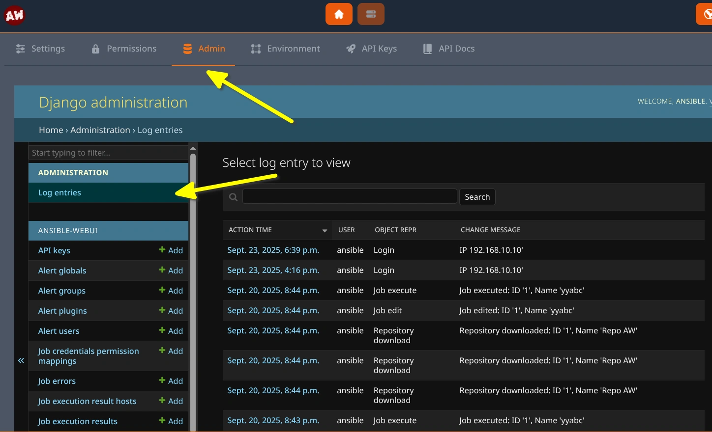
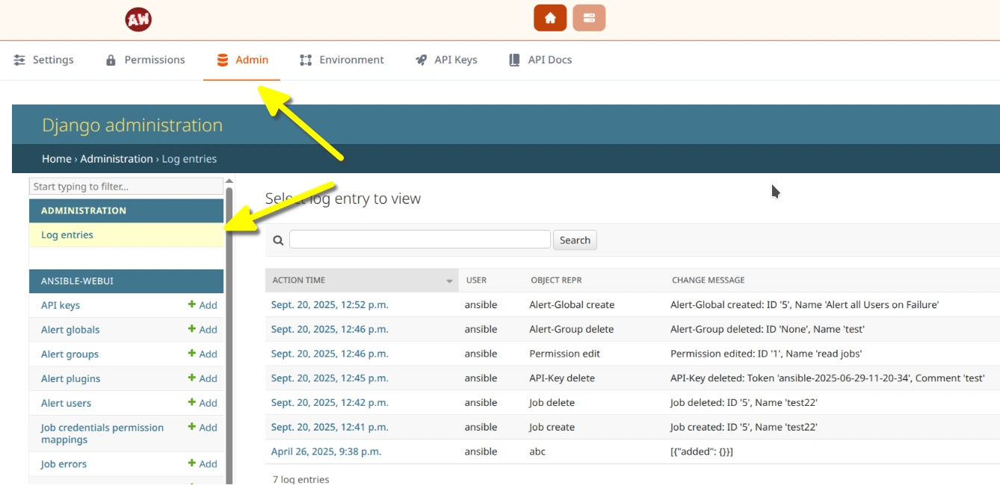
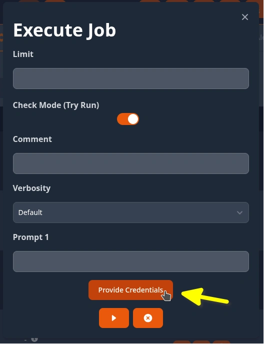
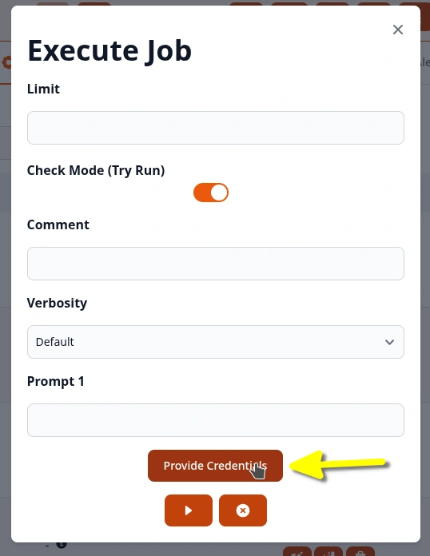

.. _usage_security:

.. include:: ../_include/head.rst

========
Security
========

Ansible needs to handle sensible secrets like administrative passwords to function.

That's why it is very important to keep security in our mind.

You are very welcome to search for security vulnerabilities and `report them <https://github.com/O-X-L/ansible-webui/issues>`_!

.. warning::

    The most secured application can be exploited if provisioned/set-up/configured incorrectly!

    Make sure to heavily restrict access to your **SECRET** and database access.

    If an attacker has those keys - they will be able to execute any job (*and thus code*) on any remote target with all saved credentials!

    **Be aware of that risk!**

----

.. _usage_security_issues:

Known Issues
************

* **Remote-Code-Execution on Controller**

  As mentioned in `this issue <https://github.com/ansibleguy/webui/issues/33>`_ the Ansible-Execution is done in the same context as the Web-Service.

  So you should be aware that every user that can supply the Web-Service with playbooks, or execute ad-hoc commands, is able to execute code in the context of the service-user.

  This **includes reading the config-file**!

  So if possible - you should set your **AW_SECRET** (*and other secrets*) as environmental variable!

  **Possible workaround**:

  * Supply secrets only via **Temporary Credentials** - they are only accessible once

  **Possible future fixes**:

  * Run Ansible-Runner with `process-isolation (execution in container) <https://ansible.readthedocs.io/projects/runner/en/stable/standalone/#running-with-process-isolation>`_ enabled (*not yet implemented in AW*)

  * Run Ansible-Runner as `dedicated user <https://github.com/ansible/ansible-runner/issues/1350>`_ (*not yet implemented in Ansible-Runner and AW*)

  * Run multiple Instances of this lightweight App in separate containers to cleanly separate the access to credentials.

----

Features
********

Security alerts are logged to stderr with the :code:`SECURITY ALERT` keyword.

Security considerations this project does take into account:

* The encryption key is randomized at startup by default - if none was provided by the user.

* The encryption key has to be at least 30 characters long

* Job secrets like passwords are stored encrypted (*AES256-CBC*)

* Job secrets like passwords are never returned to the user/Web-UI

* Runtime handling of secrets is done by the official `ansible-runner <https://ansible.readthedocs.io/projects/runner/en/latest/intro>`_ module (using :code:`pexpect` and :code:`ssh-agent`)

* Usage of GitHub's `dependabot <https://docs.github.com/en/code-security/supply-chain-security/understanding-your-software-supply-chain/about-supply-chain-security#what-is-dependabot>`_ and `CodeQL <https://docs.github.com/code-security/code-scanning/automatically-scanning-your-code-for-vulnerabilities-and-errors/about-code-scanning-with-codeql>`_

* Usage of `Content-Security-Policy <https://developer.mozilla.org/en-US/docs/Web/HTTP/CSP>`_ to protect against XSS and injections

* Whenever jobs are executed by a user (*via WebUI or API*) AW verifies that the user is actually permitted to use the credentials.

* Whenever jobs are created or modified - the modifying user is set as job-owner.

  When executing jobs on a schedule - AW verifies that this job-owner is permitted to use the configured credentials.

  If a job-owner gets deleted - the linked scheduled jobs will get denied access to any credentials.

* A basic job-queue validation that checks that the entries of the queue were actually created by the application.

  This lowers the danger of an attack-vector that would utilize DB-write-access to execute jobs.

* Users can supply **temporary job-credentials** at the ad-hoc execution-form.

  These credentials are only saved until the job starts.

  After the credentials were read by the pre-start stage - the temporary encryption-key is deleted.

  |creds_tmp_dark|

  |creds_tmp_light|

* All create/update/delete/execute actions by users are logged inside the **Audit Log** (*opt-out in the System-Settings*)

  |audit_log_dark|

  |audit_log_light|

----

Setup
*****

* You should use a proxy like nginx in front of AW

    Recommended Config: (`Example <https://github.com/O-X-L/ansible-webui/blob/latest/examples/nginx.conf>`_)

    * use HTTPS with a valid certificate

    * restrict the HTTP security headers (X-Frame-Options, X-Content-Type, Content-Security-Policy and Referrer-Policy, HSTS)

    * limit the networks able to access the Web-application using your firewall(s)

    * limit the `request rate <https://docs.nginx.com/nginx/admin-guide/security-controls/controlling-access-proxied-http/>`_ on the login form :code:`/a/*` and API :code:`/api/*`

    * serve static files using the proxy

        :code:`/static/ => ${PATH_VENV}/lib/python${PY_VERSION}/site-packages/oxl_ansible_webui/aw/static/`

* Make sure the Account passwords and API keys are kept/used safe

----

Target Systems
**************

On Linux-Target-Systems it is recommended to limit the IP-addresses, from which the automation-user (*configured for Ansible-WebUI*) is allowed to connect from.

Besides the network-level limitations by the host-level firewall, you can do so in the SSH-server config:

.. code-block::

    # file: /etc/ssh/sshd_config

    ...

    Match User <USER>
        AllowUsers <USER>@<IP>/32

    # example:
    Match User ansible
        AllowUsers ansible@192.168.0.10/32

    ...
