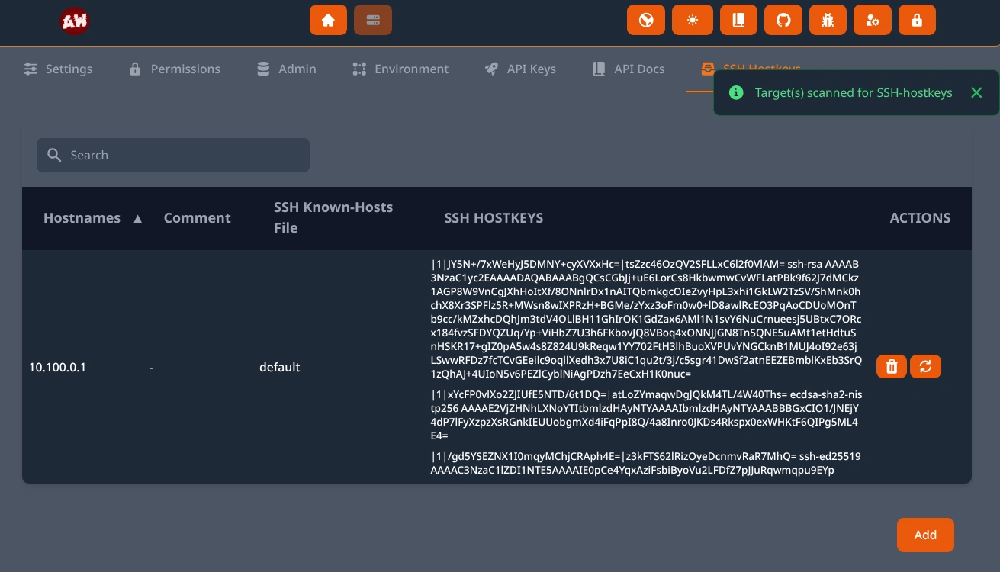
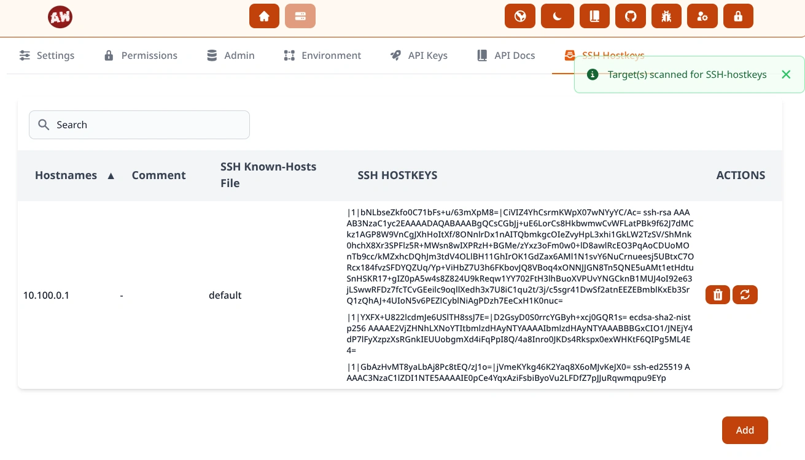
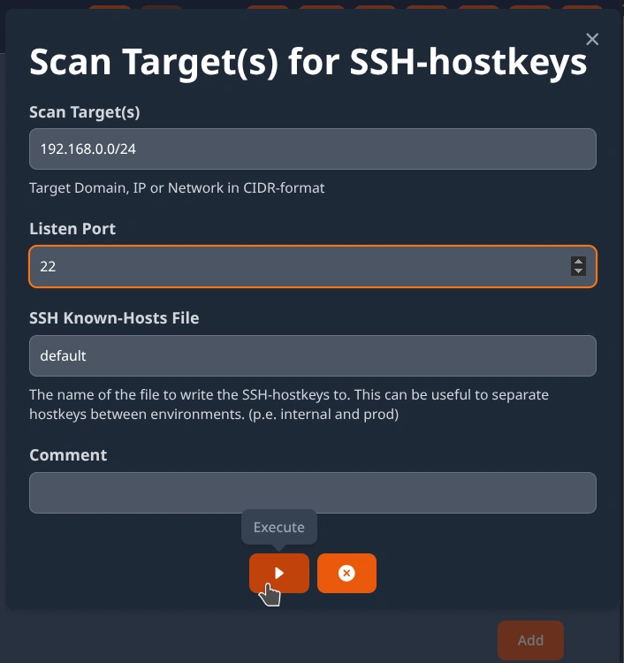
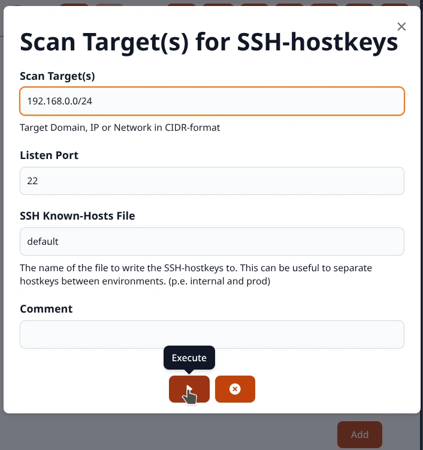
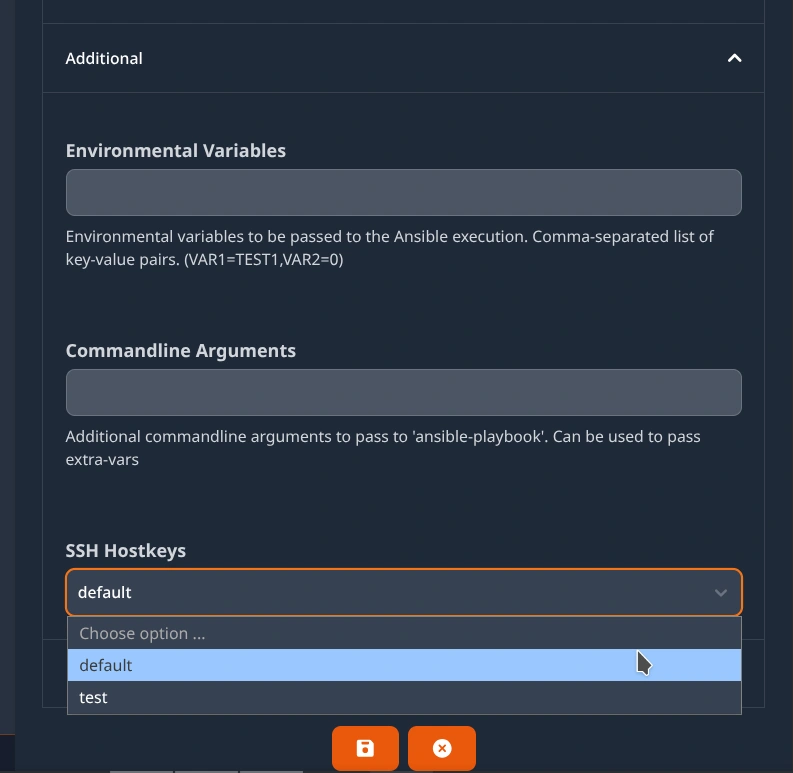
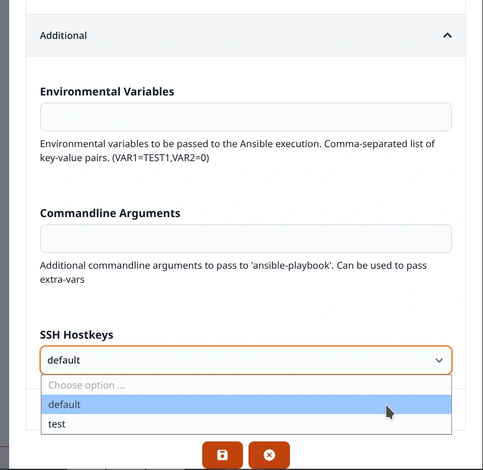
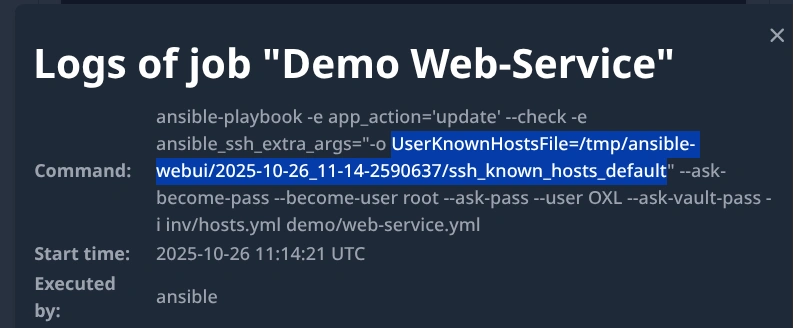
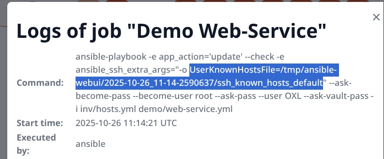

.. _usage_ssh_hostkeys:

.. include:: ../_include/head.rst

============
SSH Hostkeys
============

Manage
######

At the :code:`System - SSH Hostkeys` page you can add and manage known hosts.

|ssh_hostkey_dark|

|ssh_hostkey_light|

You are able to scan targets for existing hostkeys by supplying a DNS-Hostname, IP or Network in CIDR-format.

If you supply a DNS-Hostname - the resolved IPs will also be scanned.

|ssh_hostkey_scan_dark|

|ssh_hostkey_scan_light|

----

Linking
#######

You are able to link SSH-Hostkey-files to Jobs and Repositories.

|ssh_hostkey_job_dark|

|ssh_hostkey_job_light|

You can verify it in the logs:

|ssh_hostkey_log_dark|

|ssh_hostkey_log_light|
